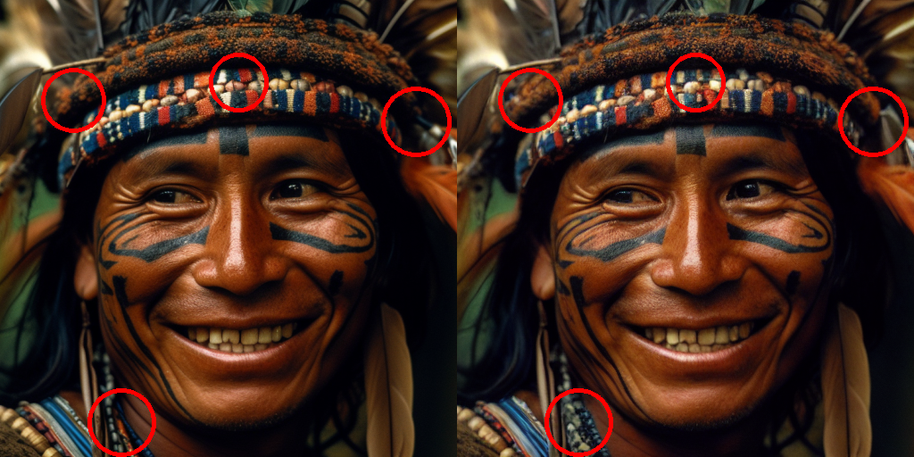
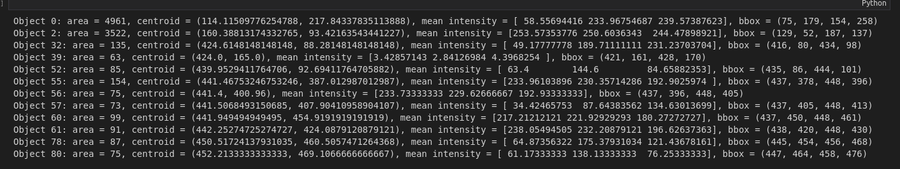
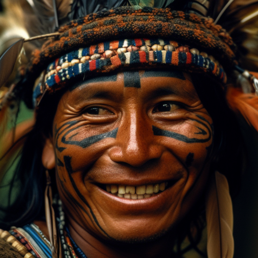
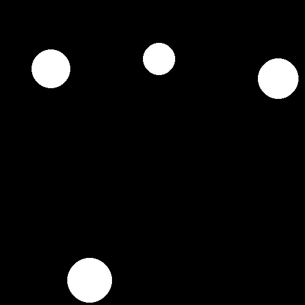
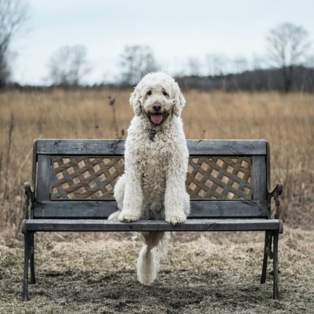

# Bài tập Xử Lý Ảnh giữa kỳ - UET

# Link Github

https://github.com/hnagn2003/Spot-The-Differences

## Tính năng

- Từ ảnh input, generate ảnh có một số điểm sai khác với ảnh gốc phục vụ game Find The Differences.
- Từ hai ảnh, chỉ ra (khoanh tròn) các điểm khác nhau.



# 1. Level 1 + 2

Level 1 và 2 sẽ hoạt động trên ảnh animated, mang tính đơn giản

## 1.1. Pipeline

💡 Ý tưởng thuật toán: Segment input image để phát hiện các objects, từ đó thực hiện các thay đổi đối với objects để tạo ra ảnh có các điểm khác với ảnh gốc. 

### 1.1.1. Input, Output

Thông qua terminal có thể config các thông số:

- level: độ khó trò chơi, 1 hoặc 2. Level càng cao, object càng nhỏ.
- input image: path
- output: output folder
- nums_of_output: số lượng output cần generate, mặc định mỗi lần generate sẽ tạo ra 3 ảnh
- nums_of_spots: số điểm sai khác tạo ra so với ảnh gốc

```python
def parse_args():
    parser = argparse.ArgumentParser()
    parser.add_argument(
        '--level',
        default=1,
        help='level of generate')
    parser.add_argument(
        '--input_image',
        default='input/input_image.png',
        help='input image file/url')
    parser.add_argument(
        '--output',
        default='output',
        help='output image file/url')
    parser.add_argument(
        '--nums_of_output',
        default=3,
        help='number of output'
    )
    parser.add_argument(
        '--nums_of_spots',
        default=3,
        help='number of spots'
    )
    args = parser.parse_args()
    return args
```

Đọc ảnh input/input_image.png:

```jsx
input_img = cv2.imread(args.input_image)
```


### 1.1.2. Detect objects

Từ input, ta sẽ thực hiện việc segment bằng thư viện pymeanshift

```jsx
labels_image, objects = segment(input_img, args.level)
```

Pymeanshift algorithm:
- Input: Image
- Output: Các objects, được đại diện bằng label (id), centroid, area, bounding box, mean_intensity, …
- Mục đích: Detect các objects trong ảnh, phục vụ việc remove, change color, …
- Ý tưởng thuật toán: Clustering: chọn điểm ảnh ngẫu nhiên, sau đó tìm tất cả các điểm tương đồng ở gần nó trong bandwidth. Sau đó tìm cluster center mới, cứ thế lặp đi lặp lại để phát hiện ra segment.

```python
def segment(img, level):
    spatial_radius=6
    range_radius=4.5
    min_density=50

    (segmented_image, labels_image, number_regions) = pms.segment(img,
                                                                spatial_radius,
                                                                range_radius,
                                                                min_density
                                                    )

    props = measure.regionprops(labels_image, intensity_image=img)

    # filter regions based on size and shape
    min_area = 100  # minimum area of an object in pixels
    max_area = 100000
    max_eccentricity = 0.8  # maximum eccentricity of an object
    if (level == 1):
        min_area = 50  # minimum area of an object in pixels
        max_area = 100000
        max_eccentricity = 0.8  # maximum eccentricity of an object
    if (level == 2):
        min_area = 25  # minimum area of an object in pixels
        max_area = 100
        max_eccentricity = 0.8  # maximum eccentricity of an object
        
    objects = []
    for i, prop in enumerate(props):
        if prop.area >= min_area and prop.area <= max_area and prop.eccentricity <= max_eccentricity:
            objects.append({
                'label': i,
                'area': prop.area,
                'centroid': prop.centroid,
                'bbox': prop.bbox,
                'mean_intensity': prop.mean_intensity,
                'min_intensity': prop.min_intensity,
                'max_intensity': prop.max_intensity
            })

    display or use the object information
    for obj in objects:
        print(f"Object {obj['label']}: area = {obj['area']}, centroid = {obj['centroid']}, mean intensity = {obj['mean_intensity']}, bbox = {obj['bbox']}")
    return labels_image, objects
```




Ở bên trên, labels_image là một ma trận đại diện cho các objects, có cùng size với ảnh input. Cụ thể, mỗi một phần tử trong labels_image sẽ là label của chính object tương ứng với nó trong ảnh gốc. Cùng một objects sẽ được đại diện bằng các label bằng nhau. Cái này được gọi là segmentation mask.

### 1.1.3. Remove, Change Color

Để tạo ra các điểm khác so với ảnh gốc, ta có thể remove hoặc change color của object

Việc này được thực hiện bằng cách thay thế ma trận object thành ma trận màu background (remove) hoặc màu tùy ý (change color). 

```python
for i, obj in enumerate (random_objs):
        label_to_change = obj['label']
        modify = random_modify[i]
        object_color = background_color if modify == 0 else get_random_color()

        # Set the pixel values of the object to the desired color using NumPy indexing
        output_img[labels_image == (label_to_change+1)] = object_color
        img_id = datetime.datetime.now().strftime('%f')

    cv2.imwrite(output_dir+'/'+img_id+'.png', output_img)
```

Ta được output như sau:


So sánh với ảnh gốc ở phía trên, mặt trời đã biến mất (remove), mây, chân ghế, ngọn cỏ thay màu (change color). 

Việc chọn modify (remove hoặc change color), việc chọn objects để modify là ngẫu nhiên.

## 1.2. Level 1 vs Level 2

Level 1 so với level 2 chỉ khác nhau ở chỗ, level 1 sẽ modify các vật to (area lớn), level 2 modify các vật nhỏ hơn.

```python
def segment(img, level):
#...
	min_area = 100  # minimum area of an object in pixels
	    max_area = 100000
	    max_eccentricity = 0.8  # maximum eccentricity of an object
	    if (level == 1):
	        min_area = 50  # minimum area of an object in pixels
	        max_area = 100000
	        max_eccentricity = 0.8  # maximum eccentricity of an object
	    if (level == 2):
	        min_area = 25  # minimum area of an object in pixels
	        max_area = 100
	        max_eccentricity = 0.8  # maximum eccentricity of an object
#...

```

## 1.3. Implementation & Run

- Implementation.
    
    ```python
    git clone https://github.com/hnagn2003/Spot-The-Differences
    cd pymeanshift
    ./setup.py install
    pip install -r requirements.txt
    ```
    

```python
python main.py --level=1
python main.py --level=1 --nums_of_spots=4

python3 find_the_differences.py --img1 ./input/input_image.png --img2  ./output/output.png
python3 find_the_differences.py --img1 input/input_lv3.png --img2  level_3/output.png
```

Như vậy, ta đã hoàn thành 2 level đầu tiên, với những thuật toán vô cùng đơn giản để xử lý việc generate ảnh đối với animated image. Vậy còn ảnh thực thì sao?

# 2. Level 3

Vẫn là vấn đề nêu trên, với input là ảnh thực.

Please check my colab and run it with GPU environment:

[Google Colaboratory](https://colab.research.google.com/drive/1s8n5mo4VKDIGOSgCi4Ih0B8GAPGkI6zz?usp=sharing)

## 2.1. Pipeline

Đọc vào input image



Tạo ra các mask bằng cách lấy generate ngẫu nhiên các hình tròn có radius trong khoảng xác định:



💡 Ý tưởng: Sử dụng pretrained model Stable Diffusion Inpainting (diffusers/clipseg/weights/rd64-uni.pth) để repaint các vùng trong phạm vi vòng tròn trắng. Chỉ đơn giản là vậy, ta có output: 


Đó là tất cả. Check my modified Diffusers here: https://github.com/hnagn2003/diffusers2.

## 2.2. About Stable Diffusions Inpainting

### 2.2.1. Demo

SDI là một mô hình tích hợp cả khả năng xử lý ngôn ngữ tự nhiên. Mô hình có khả năng extract features của prompt ta nhập vào, contribute tới output là dữ liệu được generate ra trong phạm vi hình tròn trắng (phần bị missing, damaged).



```python
prompt="pikachu"
output = predict("input/input_lv3.png", "mask.png", prompt)
```


Có thể thấy khả năng recovery ảnh của SDI là khá ấn tượng, natural.

- Deployed App:

[Stable Diffusion Inpainting - a Hugging Face Space by multimodalart](https://huggingface.co/spaces/multimodalart/stable-diffusion-inpainting)

- Please take a look of it paper: [https://arxiv.org/abs/2112.10003](https://arxiv.org/abs/2112.10003)
- My modified SDI repo: https://github.com/hnagn2003/Stable-Diffusion-Inpainting

### 2.2.2. Introduction

SDI là một giải pháp cho bài toán trọng yếu Image Segmentation. Nó biến đổi vùng ảnh được masked dựa trên thông tin của image & text prompt.

### 2.2.3. Pipeline

Ý tưởng thuật toán: Kỹ thuật chính của SDI là Partial Differential Equations. Nó tổng hợp thông tin của đặc trưng của vùng ảnh đã biết, trải qua huấn luyện với các prompt, để generate ra thông tin bị missing.

Kiến trúc transformer-based được sử dụng để tổng hợp thông tin từ image và text để tạo ra segmentation mask (em đã đề cập ở 1.1.2)

- Visual information được extracted qua mạng CNN
- Textual information: processed using a language model encoder.

2 encoders này sẽ được tập hợp qua self-attention


Model được em sử dụng ở đây là CLIPSeg (diffusers/clipseg), với backbone ViT-B/16, pretrained weight (diffusers/clipseg/weights/rd64-uni.pth). 

# 3. Spot the Differences

find_the_differences.py

- Input: 2 images
- Output: mark điểm khác biệt giữa 2 images
- Ý tưởng thuật toán:
    - Input images được convert thành blurred grayscale, sau đó tính toán differences bằng cv2.absdiff().
    
    ```python
    # Convert images to grayscale and blur them
        gray1 = cv2.cvtColor(img1, cv2.COLOR_BGR2GRAY)
        gray2 = cv2.cvtColor(img2, cv2.COLOR_BGR2GRAY)
        blurred1 = cv2.GaussianBlur(gray1, (11, 11), 0)
        blurred2 = cv2.GaussianBlur(gray2, (11, 11), 0)
    
        # Compute absolute difference between the images and threshold the result
        diff = cv2.absdiff(blurred1, blurred2)
    ```
    
    - Tiếp đó cv2.threshold() sẽ tính binary mask của ảnh (khác trắng giống đen)
    
    ```python
    _, thresh = cv2.threshold(diff, threshold, 255, cv2.THRESH_BINARY)
    ```
    
    - erosion và dilation để clean thresholded image và remove noise
    
    ```python
    # Apply morphological operations to clean up the thresholded image
        kernel = cv2.getStructuringElement(cv2.MORPH_ELLIPSE, (5, 5))
        thresh = cv2.erode(thresh, kernel, iterations=2)
        thresh = cv2.dilate(thresh, kernel, iterations=4)
    ```
    
    - Chỉ lấy các blobs đáp ứng threshhold
    
    ```python
    # Label and filter blobs in the thresholded image
        labels = measure.label(thresh, connectivity=2, background=0)
        mask = np.zeros(thresh.shape, dtype="uint8")
        for label in np.unique(labels):
            if label == 0:
                continue
            labelMask = np.zeros(thresh.shape, dtype="uint8")
            labelMask[labels == label] = 255
            numPixels = cv2.countNonZero(labelMask)
            if numPixels > min_blob_size:
                mask = cv2.add(mask, labelMask)
    ```
    
    - Tìm contours của các blobs trên sau đó vẽ circles
    
    ```python
    # Find contours of the blobs and draw circles around them on the original images
        cnts = cv2.findContours(mask.copy(), cv2.RETR_EXTERNAL, cv2.CHAIN_APPROX_SIMPLE)
        cnts = imutils.grab_contours(cnts)
        cnts = contours.sort_contours(cnts)[0]
        for (i, c) in enumerate(cnts):
            (x, y, w, h) = cv2.boundingRect(c)
            ((cX, cY), radius) = cv2.minEnclosingCircle(c)
            cv2.circle(img1, (int(cX), int(cY)), int(radius), (0, 0, 255), 3)
            cv2.circle(img2, (int(cX), int(cY)), int(radius), (0, 0, 255), 3)
        res = np.concatenate((img1, img2), axis=1)
        cv2.imwrite('level_3/result.png', res)
    ```
